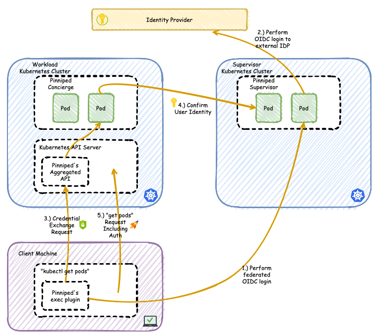

# Pinniped PoC

> [!NOTE]
> The PoC is built on [the tutorial from the Pinniped project](https://pinniped.dev/docs/tutorials/local-concierge-and-supervisor-demo/), but with tools that are more familiar to us. For example using:
>
> - GitOps over Kubectl
> - Traefik instead of Contour

This is a PoC to test the Pinniped project, and how it fits in a multi-cluster setup.

## Alternatives

- [Kubelogin](https://github.com/int128/kubelogin)

## Getting Started

> [!NOTE]
> For the PoC both the Supervisor (server) and the Concierge (agent) will be installed in the same cluster.
>
> Communication between the two will be done through ingress, to simulate a multi-cluster setup.



### Prerequisites

- [Docker](https://www.docker.com/)
- [KSail](https://github.com/devantler/ksail)
- [Pinniped CLI](https://pinniped.dev/docs/howto/install-cli/)

Set the following hostnames in your `/etc/hosts` file:

```txt
127.0.0.1 pinniped-supervisor.pinniped.svc.cluster.local
```

## Usage

To start the cluster with the Pinniped PoC, run the following command:

```sh
ksail up
```

Now you should export the CA public key used by Pinniped and test that it works.

```sh
# To create the CA public key
kubectl get secret pinniped-supervisor-tls \
  --namespace pinniped \
  -o jsonpath="{.data['ca\.crt']}" | base64 -d > supervisor-ca.crt

# To test that the supervisor is responding well to requests
curl --cacert supervisor-ca.crt \
  "https://pinniped-supervisor.pinniped.svc.cluster.local/demo-issuer/.well-known/openid-configuration"
```

And add a `JWTAuthenticator` to ensure authentication can happen between a Concierge Agent and the Central Supervisor:

```sh
# To configure Concierge to trust the Supervisor's FederationDomain.
cat <<EOF | kubectl create -f -
apiVersion: authentication.concierge.pinniped.dev/v1alpha1
kind: JWTAuthenticator
metadata:
  name: supervisor-jwt-authenticator
spec:
  # This should be the issuer URL that was declared in the FederationDomain.
  issuer: "https://pinniped-supervisor.pinniped.svc.cluster.local/demo-issuer"
  # The audience value below is an arbitrary value which must uniquely
  # identify this cluster. No other workload cluster should use the same value.
  # It can have a human-readable component, but part of it should be random
  # enough to ensure its uniqueness. Since this tutorial only uses a single
  # cluster, you can copy/paste this example value.
  audience: workload1-dd9de13c370982f61e9f
  tls:
    certificateAuthorityData: "$(cat supervisor-ca.crt | base64)"
EOF
```

To test the setup, the JWTAuthenticator should not fail. Check whether its phase is `Ready`:

```sh
kubectl get jwtauthenticator supervisor-jwt-authenticator -o yaml
```

And then we need to create a pinniped-compatible kubeconfig for the developers:

```sh
# This uses your current kubeconfig, which is the admin kubeconfig,
# to generate a new kubeconfig for the cluster.
pinniped get kubeconfig > kubeconfig.yaml
```

This allows you to use the `kubeconfig.yaml` file to access the cluster as a developer, where you authenticate against the Concierge agent that does a roundtrip to the Supervisor service. Hence providing a federated authentication model for multi-cluster setups.

```sh
# Try to check who you are as a developer
pinniped whoami --kubeconfig kubeconfig.yaml

# Try to list all namespaces as a developer
kubectl get ns --kubeconfig kubeconfig.yaml

# Try to list serviceaccounts in the dev namespace as a developer
kubectl get sa --namespace dev --kubeconfig kubeconfig.yaml
```

You will notice that you are correctly authenticated as a developer, and you can only access the `dev` namespace.

When you are done run the following command to tear down the cluster:

```sh
ksail down --registries
```

## Why Pinniped?

Pinniped is not only a project that provides federated authentication to a single cluster, but it also provides a way to authenticate users across multiple clusters. This is especially useful in multi-cluster setups where users need to access multiple clusters.

- Federated authentication for multi-cluster setups (one authentication model for all clusters)
  - A Supervisor service that provides authentication to any number of clusters. Installed on a central cluster, where app developers or devops users have no access to.
  - A Concierge service that trusts the Supervisor, and acts as an in-cluster agent to provide unified authentication services to the cluster. Installed on every workload cluster.
- Agnostic to the identity provider (it could be Dex as a middleman on the backend)
- Provides non-sensitive Kubeconfig files to users (it is easy to share kubeconfig files with tenants)
- Deep integration with `kubectl` (should make it easy to do Kubernetes API auth and RBAC)
  - Long-lived logins (login once per day)
  - Short-lived credentials (quick reaction to RBAC changes)
- Credentials are scoped per cluster (it is not possible to use high privileged credentials to access other clusters)
- Does not interfere with the original authentication system (The original admin-level kubeconfig from a cluster can be privately kept by the cluster’s creator)

## What will be tested?

The PoC will try to setup Pinniped as the primary authentication system for a single cluster, while still using both the Supervisor and Concierge services.

- The Supervisor will be installed in the `pinniped` namespace, where only the cluster admin has access to.
- The Concierge will be installed in the `pinniped` namespace, where only the cluster admin has access to.
- Kubernetes API auth will be configured to use the Concierge service, and one new user will be created.
  - A `developer` user that has access to the `dev` namespace.
- The Kubernetes API auth will be tested with various local tools (kubectl, k9s, etc.) against the `developer` user.
- Traefik and cert-manager will be deployed in their own namespaces, and help with ingress and certificates.

## What will not be tested?

- Pinniped's OIDC Client support. (<https://pinniped.dev/docs/howto/configure-auth-for-webapps/>)
  - It was analyzed thoroughly, and I deemed that it was out of scope for this PoC.
  - It does not work well with GitOps.
  - It is API-based, requiring calling an API to get a client secret.
- Pinniped and OIDC with Traefik ForwardAuth.
  - It is related to the OIDC Client support, and thus it was deemed out of scope.
  - It is possible.
  - It requires an OIDC client for the backing service that Traefik is forwarding auth to.
    - Maybe an OIDC client for Pinniped itself?
